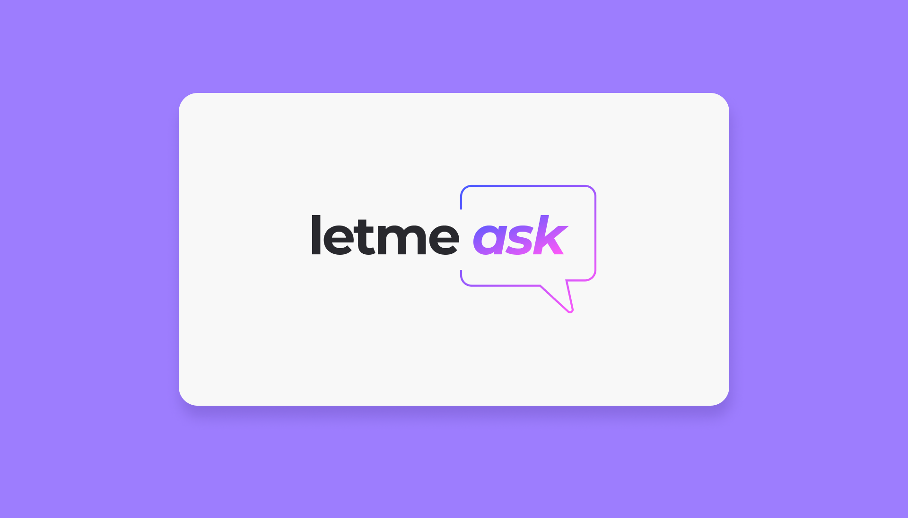
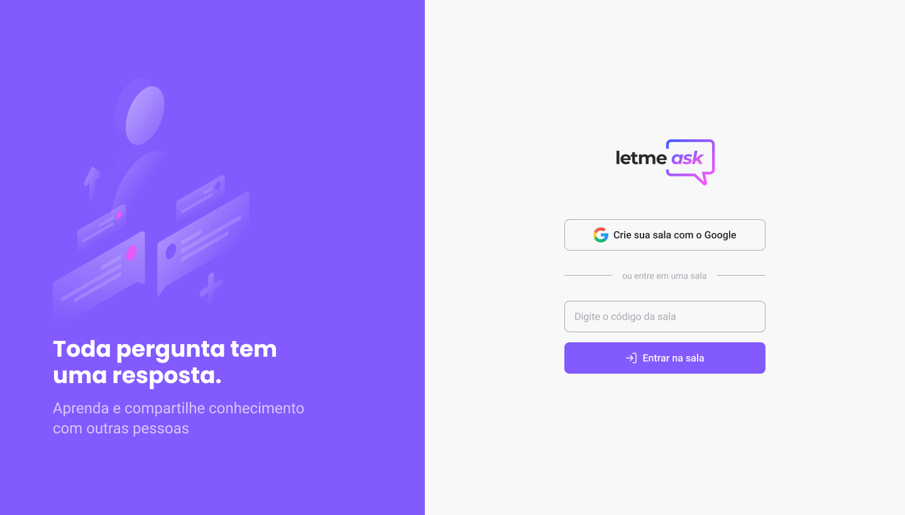

</p>
<h1 align="center">
    
</h1>

<h4 align="center"> 
	🚧  Letmeask 💭 Em andamento 🚀 🚧
</h4>

<p align="center">
 <a href="#-sobre-o-projeto">Sobre</a> •
 <a href="#-funcionalidades">Funcionalidades</a> •
 <a href="#-layout">Layout</a> • 
 <a href="#-como-executar-o-projeto">Como executar</a> • 
 <a href="#-tecnologias">Tecnologias</a> • 
 <a href="#-autor">Autor</a> • 
 <a href="#user-content--licença">Licença</a>
</p>


## 💻 Sobre o projeto

💭 Letmeask - é uma forma de você dono de live poder abrir salas para seus usuários poderem tirar duvidas.


Projeto desenvolvido durante a **NLW - Next Level Week** oferecida pela [Rocketseat](https://blog.rocketseat.com.br/primeira-next-level-week/).
O NLW é uma experiência online com muito conteúdo prático, desafios e hacks onde o conteúdo fica disponível durante uma semana.

---

## ⚙️ Funcionalidades

...
---

## 🎨 Layout

O layout da aplicação está disponível no Figma:

<a href="https://www.figma.com/file/u0BQK8rCf2KgzcukdRRCWh/Letmeask">
  
</a>


### Web

<p align="center" style="display: flex; align-items: flex-start; justify-content: center;">
  

</p>

---

## 🚀 Como executar o projeto
### Pré-requisitos

Antes de começar, você vai precisar ter instalado em sua máquina as seguintes ferramentas:
[Git](https://git-scm.com), [Node.js](https://nodejs.org/en/). 
Além disto é bom ter um editor para trabalhar com o código como [VSCode](https://code.visualstudio.com/)

#### 🧭 Rodando a aplicação web (Frontend)

```bash

# Clone este repositório
$ gh repo clone leokattah/Letmeask

# Acesse a pasta do projeto no seu terminal/cmd
$ cd letmeask

# Instale as dependências
$ yarn install
# ou npm install

# Execute a aplicação em modo de desenvolvimento
$ yarn start
# ou npm run start

# A aplicação será aberta na porta:3000 - acesse http://localhost:3000

```

 Quer ver a aplicação no seu navegador? https://letmeask-lk.web.app/


---

## 🛠 Tecnologias

As seguintes ferramentas foram usadas na construção do projeto:

#### **Website**  [React](https://reactjs.org/)  +  [TypeScript](https://www.typescriptlang.org/) + [React Router Dom](https://github.com/ReactTraining/react-router/tree/master/packages/react-router-dom) +  [Firebase real database](https://firebase.google.com/)

## Autor

<a href="https://devleokattah.herokuapp.com/">
 
 <br /
[Website com o portfólio]("https://devleokattah.herokuapp.com/")
 <br />
 

---

## 📝 Licença

Este projeto esta sobe a licença [MIT](./LICENSE).

Feito com ❤️ por Leonardo Kattah 👋🏽 [Entre em contato!](https://www.linkedin.com/in/leonardo-kattah-55059a20/)
